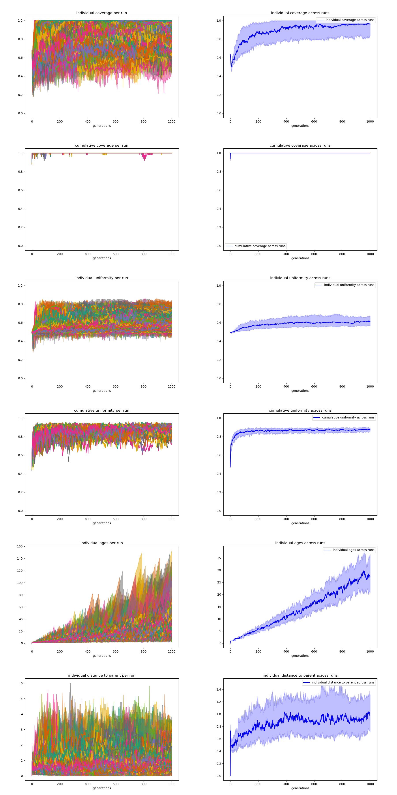
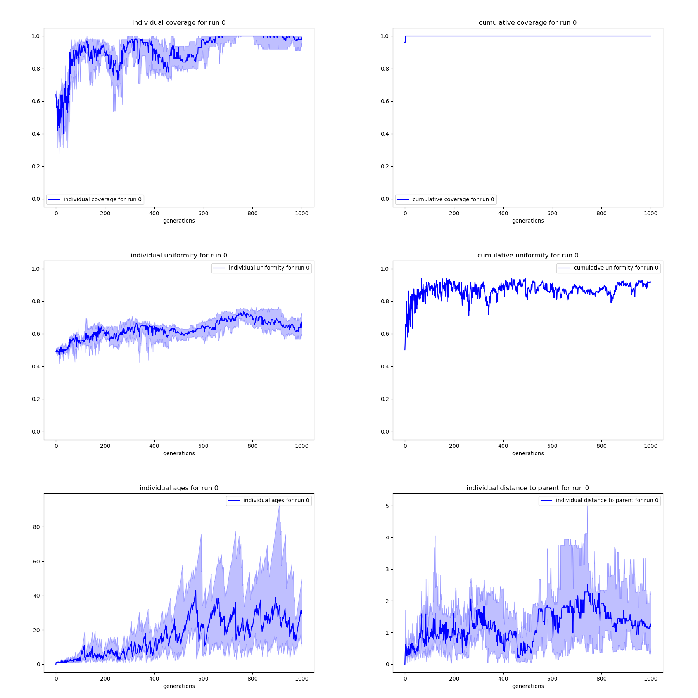
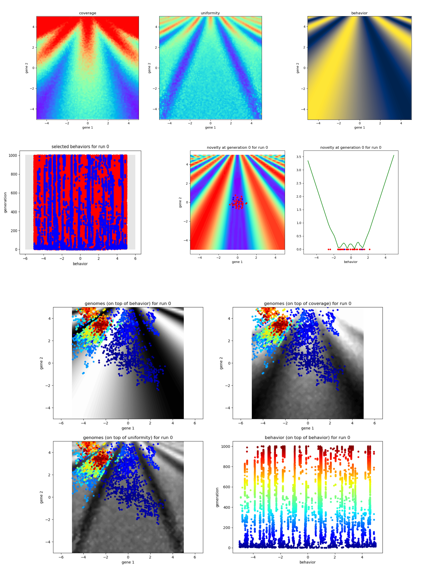

# Simple-NS [](https://www.python.org/downloads/)

Simple-NS is a light set of tools to study the behavior of Novelty Search algorithms
in simple low-dimensional settings in which one can easily visualize their behavior.

Several Hand-designed mappings from a 2D genome space to a 1D behavior space are
implemented, and several strategies to compute novelty and select individuals at each
generation are implemented.

An Experiment class is used to simulate a search, and an Analyzer class is used
to compute and plot the stats over multiple experiments.

Simple-NS has been used to produce the "toy problem" results of the paper
"Novelty Search makes Evolvability Inevitable" (Stéphane Doncieux, Giuseppe Paolo,
Alban Laflaquière, Alexandre Coninx - Genetic and Evolutionary Computation Conference, 2020).


## Installation

Use [pip](https://pip.pypa.io/en/stable/user_guide/) to install the required modules.

```bash
pip install -r requirements.txt
```

## Usage

Using [Python 3](https://www.python.org/downloads/) (tested with Python 3.8.2), simply
run main.py to launch the standard experiment. 

```bash
python main.py
```

It will run 100 standard Novelty Search trials in parallel and display the results.

#### Search parameters

The parameters.py file can be modified to change the parameters of the search.
See the included comments for more information.  

```python
parameters = {
    "mapping": "2D_cosinus",                   # type of genome-to-behavior mapping {'linear', 'hyperbolic', 'bounded_linear', 'linear_seesaw', 'multiplicative', 'soft_multiplicative', 'hyperbolic_seesaw', 'multiplicative_seesaw', 'cosinus', '2D_cosinus', 'multiplicative_cosinus', 'peaks', '2D_peaks'}
    "eta": 45,                                 # mutation spread parameter
    "n_pop": 20,                               # number of individuals in the population
    "n_offspring": 40,                         # number of offsprings generated from the population at each generation
    "criterion": "novelty",                    # type of novelty computation {'novelty', 'hull', 'fitness', 'random'}
    "n_neighbors": 10,                         # number of closest neighbors to compute the "novelty" criterion
    "best_fit": -4,                            # arbitrary behavior with the maximum fitness for the "fitness" criterion
    "n_selected": 6,                           # number of offsprings added to the archive at each generation
    "addition": "random",                      # strategy to add individuals to the archive {'novelty', 'random'}
    "n_evolvability": 1000,                    # number of samples generated from each genome to evaluate its evolvability
    "n_epochs": 1000,                          # number of generations of the search process
    "restart": 99999,                          # generation at which the population is re-initialized
    "frozen": 99999,                           # generation at which the reference set for the novelty computation is frozen
    "n_runs": 100,                             # number of experiments to run in parallel
    "name": "standard_novelty_random_100runs"  # name of the results file (can be None))
}
```

#### Manual run

To manually run a set of experiments, you can simply call the two following 
functions from ./tools/simpleNS.py:

```python
from parameters import parameters
data = run_in_parallel(parameters)
save_experiment_results(parameters, data)
```

#### Results storing

Running main.py (or tools.simpleNS.save_experiment_results()), the results of the experiments
are saved in a single pickle file ./results/\<name of the experiment\>.pkl.
It consists of a list of dictionaries each containing the full history of the archive, population,
and offsprings generated at each generation for the corresponding trial.

Each history is stored as a TxNxS ndarray, with T the number of generations, N the number of
individuals, and S the size of an individual.
Each individual is stored as a vector of length S according to the following indexation:

```python
# indexation
I_PARENT = 0  # index of the parent in the previous generation
I_GENERATION = 1  # generation at which the agent is created
I_SELECTED_POP = 2  # flag indicating if the individuals is selected to be part of the next population
I_SELECTED_ARC = 3  # flag indicating if the individuals is selected to be part of the archive
I_AGE = 4  # age of the individuals = number of generations since its creation
I_GENOME = [5, 6]  # 2D genome
I_BEHAVIOR = 7  # 1D behavior
I_DISTANCE = 8  # distance to the parent when the individual is created
I_NOVELTY = 9  # novelty of the individual
I_COVERAGE = 10  # coverage associated with the genome
I_UNIFORMITY = 11  # uniformity associated with the genome
I_CUM_COVERAGE = 12  # cumulative coverage associated with the current group of individuals
I_CUM_UNIFORMITY = 13  # cumulative uniformity associated with the current group of individuals
```

#### Computing stats over the results

To analyze the results, create an Analyzer object and call the get_all_stats method.

```python
analyzer = tools.analyze.Analyzer(save_figures=False)
population_stats = analyzer.get_all_stats(group="population")
archive_stats = analyzer.get_all_stats(group="archive")
offsprings_stats = analyzer.get_all_stats(group="offsprings")
```

It will generate a dictionary containing the following statistics:
```python
stats = {"median_ind_coverages",            # medians of the individual coverages for all trials
         "fq_ind_coverages",                # first quartile of the individual coverages for all trials
         "tq_ind_coverages",                # third quartile of the individual coverages for all trials
         "median_median_ind_coverages",     # median of the medians coverages across all trials
         "fq_median_ind_coverages",         # first quartile of the medians coverages across all trials
         "tq_median_ind_coverages",         # third quartile of the medians coverages across all trials
         "median_ind_uniformities",         # medians of the individual uniformity for all trials
         "fq_ind_uniformities",             # first quartile of the individual uniformity for all trials
         "tq_ind_uniformities",             # third quartile of the individual uniformity for all trials
         "median_median_ind_uniformities",  # median of the medians uniformities across all trials
         "fq_median_ind_uniformities",      # first quartile of the medians uniformities across all trials
         "tq_median_ind_uniformities",      # third quartile of the medians uniformities across all trials
         "median_cum_coverages",            # medians of the cumulative coverages of all individuals for all trials
         "fq_cum_coverages",                # first quartile of the cumulative coverages of all individuals for all trials
         "tq_cum_coverages",                # third quartile of the cumulative coverages of all individuals for all trials
         "median_median_cum_coverages",     # median of the medians cumulative coverages across all trials
         "fq_median_cum_coverages",         # first quartile of the medians cumulative coverages across all trials
         "tq_median_cum_coverages",         # third quartile of the medians cumulative coverages across all trials
         "median_cum_uniformities",         # medians of the cumulative uniformity of all individuals for all trials
         "fq_cum_uniformities",             # first quartile of the cumulative uniformity of all individuals for all trials
         "tq_cum_uniformities",             # third quartile of the cumulative uniformity of all individuals for all trials
         "median_median_cum_uniformities",  # median of the medians cumulative uniformity across all trials
         "fq_median_cum_uniformities",      # first quartile of the medians cumulative uniformity across all trials
         "tq_median_cum_uniformities",      # third quartile of the medians cumulative uniformity across all trials
         "median_ages",                     # medians of the individuals' age for all trials
         "fq_age",                          # first quartile of the individuals' age for all trials
         "tq_age",                          # third quartile of the individuals' age for all trials
         "median_median_ages",              # median of the medians of individuals' ages across all trials
         "fq_median_ages",                  # first quartile of the medians of individuals' ages across all trials
         "tq_median_ages",                  # third quartile of the medians of individuals' ages across all trials
         "median_distances",                # medians of the individuals' distance to parent for all trials
         "fq_distances",                    # first quartile of the individuals' distance to parent for all trials
         "tq_distances",                    # third quartile of the individuals' distance to parent for all trials
         "median_median_distances",         # median of the medians of individuals' distance to parent across all trials
         "fq_median_distances",             # first quartile of the medians of individuals' distance to parent across all trials
         "tq_median_distances",             # third quartile of the medians of individuals' distance to parent across all trials
         }
```

To display the statistics across generations, use:
```python
analyzer.display_all_stats(stats)
```



If analyzer.save_figures is set to True, the figures will also be saved
in ./figures/\<name of the experiment\>/\<name of the statistic\>.svg and
./figures/\<name of the experiment\>/\<name of the statistic\>.png.

Additional display options are available. Experiment with them, or check the included comments
to know what visualization they provide.

```python
analyzer.display_mapping()
analyzer.display_mapping_evolvability()
analyzer.display_run_stats(stats, run=0)
analyzer.display_search_history(group="population", run=0)
analyzer.display_selected_individuals(run=0)
analyzer.display_novelty(run=0, generation=500)
```



